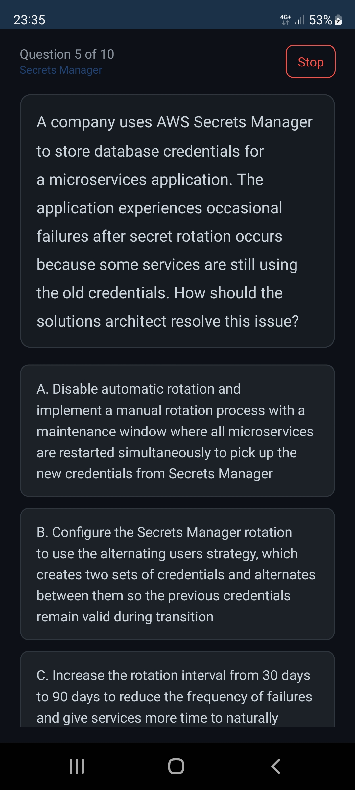
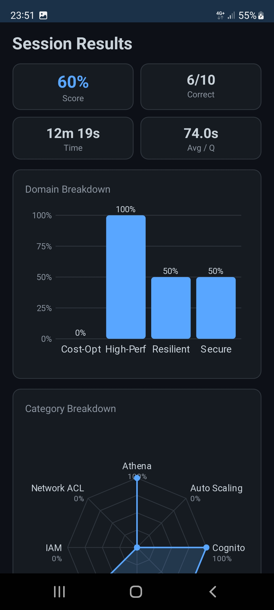
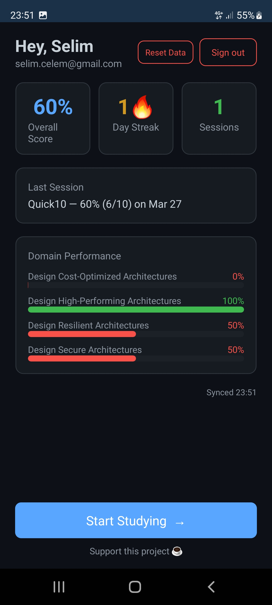
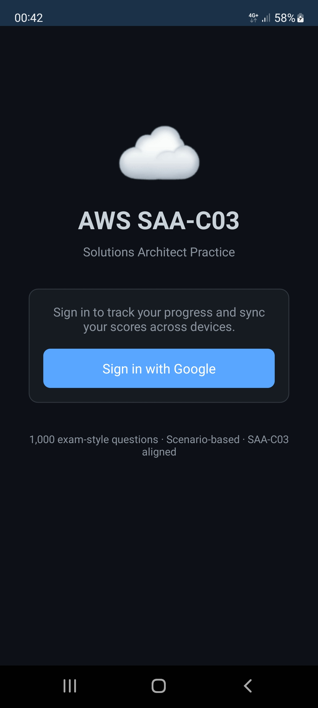

# AWS SAA-C03 Practice App

A cross-platform quiz application for Windows desktop and Android that helps you study for the **AWS Certified Solutions Architect – Associate (SAA-C03)** exam.

> Built with .NET MAUI (.NET 8), backed by AWS Cognito + S3, infrastructure managed via Terraform.

---

## Download

[Download the latest Android APK](https://github.com/selimcelem/aws-saa-c03-practice-app/releases/latest) directly from GitHub Releases.

Enable "Install from unknown sources" on your Android device, then open the APK to install.

---

## Screenshots






---

## Features

- 1,000 scenario-based practice questions across all 4 SAA-C03 exam domains
- Four study modes: Random, Exam Simulation (65Q / 130min), Quick 30, Quick 10
- Detailed answer explanations with AWS concept references
- Performance dashboard: score by domain, radar chart, "needs work" categories
- Google Sign-In via Cognito, score history synced to S3
- Local SQLite history — works offline
- Question reporting — flag problematic questions directly from the quiz

---

## Prerequisites

| Tool | Version | Install |
|---|---|---|
| .NET SDK | 8.0+ | https://dot.net |
| MAUI workloads | - | `dotnet workload install maui-android maui-windows` |
| AWS CLI | 2.x | https://aws.amazon.com/cli |
| Terraform | 1.7+ | https://terraform.io/downloads |
| Git | any | https://git-scm.com |
| Android device or emulator | Android 8.0+ | - |

---

## Setup from Scratch

### 1. Clone the repository
```bash
git clone https://github.com/<your-username>/aws-saa-c03-practice-app.git
cd aws-saa-c03-practice-app
```

### 2. Configure AWS credentials
```bash
aws configure
# Enter: Access Key ID, Secret Access Key, region: eu-west-1, output: json
```

### 3. Deploy infrastructure
```bash
cd infra
terraform init
terraform apply
# Note the outputs: cognito_user_pool_id, cognito_client_id, s3_bucket_name, cognito_domain, sns_topic_arn
# After apply: confirm the SNS subscription email for question report digests
```

### 4. Set up Google OAuth
1. Go to [Google Cloud Console](https://console.cloud.google.com) → APIs & Services → Credentials
2. Create an OAuth 2.0 Client ID (Web application type)
3. Add the Cognito domain as an authorised redirect URI: `https://<cognito_domain>/oauth2/idpresponse`
4. Copy the Client ID and Client Secret

### 5. Configure environment variables
```bash
cp .env.example .env
# Edit .env with your Terraform outputs and Google OAuth credentials
```

### 6. Wire Google into Cognito
```bash
cd infra
terraform apply  # Second apply with Google credentials wired in
```

### 7. Build and run

**Windows:**
```bash
dotnet build -f net8.0-windows10.0.19041.0
dotnet run -f net8.0-windows10.0.19041.0
```

**Android (USB device):**
```
Settings → About Phone → tap Build Number 7 times → enable Developer Options → enable USB Debugging
Plug phone into PC via USB and accept the debugging prompt
```
```bash
dotnet build -t:Run -f net8.0-android
```

---

## Destroying Infrastructure

To bring cost to exactly **$0**:
```bash
cd infra
terraform destroy
```

All resources are tagged `Project=saa-c03-practice-app` for easy identification.

## Rebuilding from Scratch

Follow the "Setup from Scratch" steps above. `terraform apply` rebuilds everything in under 5 minutes. The question bank is committed to the repository.

---

## Project Structure

```
aws-saa-c03-practice-app/
├── docs/
│   └── build-log.md          # Detailed step-by-step build history
├── src/
│   ├── Data/
│   │   └── questions.json    # 1,000 practice questions
│   ├── Models/               # C# data models
│   ├── ViewModels/           # MVVM view models
│   ├── Views/                # MAUI XAML pages
│   └── Services/             # AWS, auth, storage services
├── infra/
│   ├── main.tf               # S3, Cognito, IAM, Lambda, SNS, EventBridge
│   ├── lambda/               # Lambda function source code
│   ├── variables.tf
│   └── outputs.tf
├── .gitignore
├── .env.example              # Template — copy to .env
└── README.md
```

---

## CI/CD

The project uses GitHub Actions (`.github/workflows/ci.yml`) to build on every push and PR to `master`.

**Pipeline steps:**
1. **Build** — runs `dotnet build` for the Windows target on `windows-latest`
2. **Validate** — checks `questions.json` has exactly 1000 questions
3. **Deploy** — on push to `master` only, syncs `questions.json` to the S3 bucket

**Required GitHub Secrets** (set in repo Settings > Secrets and variables > Actions):

| Secret | Value |
|---|---|
| `AWS_ACCESS_KEY_ID` | IAM access key with `s3:PutObject` on the app bucket |
| `AWS_SECRET_ACCESS_KEY` | Corresponding secret key |
| `AWS_REGION` | `eu-west-1` |
| `S3_BUCKET_NAME` | `saa-c03-practice-60270d19` |

To set up: go to your GitHub repo > Settings > Secrets and variables > Actions > New repository secret, and add each of the four secrets above.

---

## Question Reporting

Users can report problematic questions directly from the quiz screen. Reports are stored in S3 and a digest email is sent twice daily (12:00 and 16:00 Amsterdam time).

**Infrastructure:** SNS topic + Lambda function + EventBridge cron rules (deployed via `terraform apply`)

**After deploying:** Confirm the SNS subscription email sent to the configured address. Reports won't trigger emails until the subscription is confirmed.

**Report storage:** `reports/{questionId}.json` in the S3 bucket — each file contains a JSON array of report objects with question ID, timestamp, user ID, optional comment, and app version.

---

## Release Build (Android)

The Android release build requires a signing keystore. The keystore must be stored **outside the repository** — losing it means you can never update the app on Play Store.

**Keystore location:** `D:\Projects\release.keystore` (never commit this file)

**Environment variables needed:**

| Variable | Value |
|---|---|
| `ANDROID_KEYSTORE_PATH` | Full path to `release.keystore` (e.g. `D:\Projects\release.keystore`) |
| `ANDROID_KEYSTORE_PASSWORD` | The keystore password |

**Set environment variables and build:**
```bash
# PowerShell
$env:ANDROID_KEYSTORE_PATH = "D:\Projects\release.keystore"
$env:ANDROID_KEYSTORE_PASSWORD = "your-keystore-password"

cd src
dotnet publish -f net8.0-android -c Release
```

The signed APK will be in `bin/Release/net8.0-android/publish/`.

**Keystore details:**
- Alias: `saa-c03-practice`
- Algorithm: RSA 2048-bit
- Validity: 10,000 days (~27 years)
- DN: `CN=Selim Celem, O=Personal, L=Utrecht, ST=Utrecht, C=NL`

---

## License

MIT
